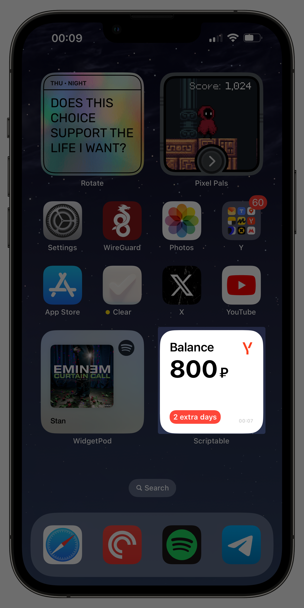

# BadgeWidget

BadgeWidget is a widget for iOS that shows the balance of your corporate badge (Y company).

It is designed to work with iOS 17 and above. (Compatibility with iOS 16 is not guaranteed).

## How to start using BadgeWidget

[Rus](ManualRu.md) / [Eng](ManualEn.md)

## Updating

- Run "Copy Badge JS" shortcut to update the source code file
